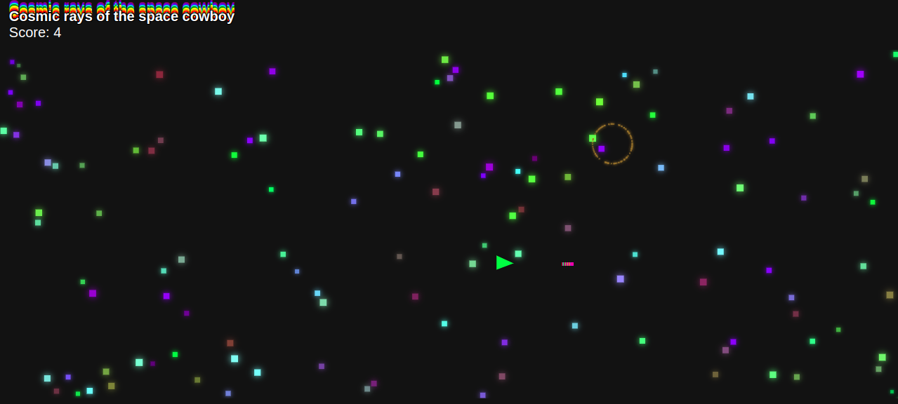
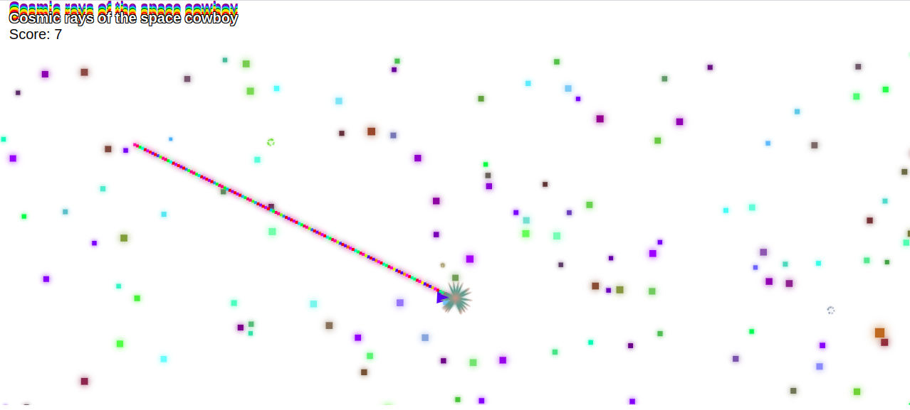

# cosmic rays of the space cowboy #

## disclaimer ##
may not be suitable for people with photosensitivite epillepsy (or similar things that i don't know much about), because it contains flashing lights, janky animations, rapidly changing colours (i mean way too many way too rapidly changing colours), and possibly other such things :-|

## tl;dr ##

## usage ##
open `index.html` in a browser. the game should start immediately.

## credits ##
inspired by the coding train videos on boids and space invaders. also i feel like i should mention craig reynolds and his work on the steering behaviour, which i didn't directly interact with, but still.